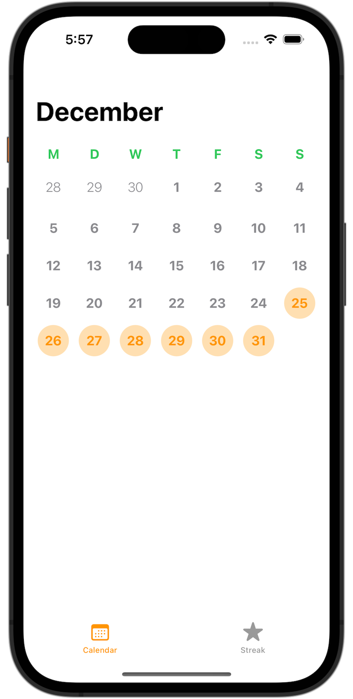
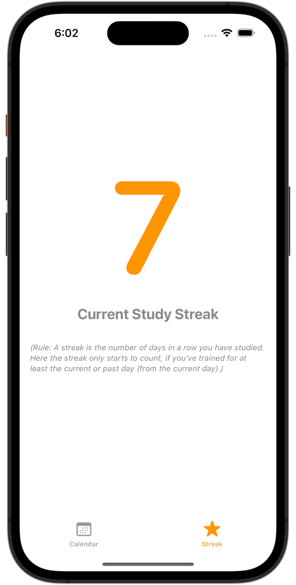
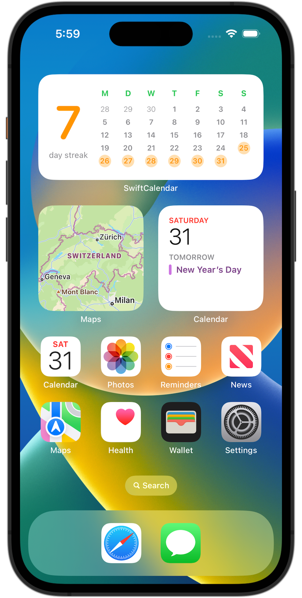

# Calendar Widget - Core Data

This App shows how one can migrate an existing App which is using a Core Data App container, to an App with a Widget Extension and a shared Core Data
container for both parts in place.

<p align="center">
    <a href="https://en.wikipedia.org/wiki/IOS">
        
    </a>
    <a href="https://www.swift.org/">
        
    </a>
    <a href="https://developer.apple.com/xcode/swiftui">
        
    </a>
    <a href="https://developer.apple.com/xcode">
        
    </a>
    <a href="https://mastodon.green/@simonberner">
        
    </a>
    <a href="https://gitmoji.dev">
        
    </a>
    <a href="https://github.com/conventional-commits/conventionalcommits.org">
        
    </a>
    <a href="https://opensource.org/licenses/MIT">
        
    </a>
</p>

---

## Contents
* [Functionality](#functionality)
* [Definitions](#definitions)
* [Tech Stack](#tech-stack)
* [Frameworks](#frameworks)
* [Device Compatibility](#device-compatibility)
* [Screenshots](#screenshots)
* [Learnings](#learnings)
* [Testing](#testing)
* [Code Comments](#code-comments)
* [Pull Requests](#pull-requests)
* [Credits](#credits)

---

## Functionality
### App
- In the calendar view the user can define/select days of study in the current month.
- The streak view shows the user for how many days they have studied in a row. As streak days count only those days, where the user has studied for at least the current or past day (from the current day) descending.
### Widget Extension
- The Widget updates in real time to the changes made in the App and automatically at the end of each day.
- As it is a medium sized Widget, there are two touch targets on it. One that deep links into the StreakView and the other into the CalendarView of the App.

## Definitions
- [First day of the week](https://www.timeanddate.com/calendar/days/first-day-of-the-week.html) is Monday.

## Tech Stack
- Xcode 14.2
- Swift 5.7.2

## Frameworks
- SwiftUI
- WidgetKit
- CoreData

## Device Compatibility
- iPhone >= iOS16+
- iPad >= iOS16+

## Screenshots
| Calendar View | Streak View | Widget View |
| :---: | :---: | :---: |
|  |  |  |

## Learnings
### Widget
- In a Widget we should NOT make async network calls (according to Apple), because of that we can't use the property wrapper '@FetchRequest' in a Widget.
#### Touch Targets (Deep linking into the App)
- Deep linking from the Widget into the App can be made by wrapping a view with ```Link()```. This is only available on a medium and a large Widget. We can not have more than one touch targets on a small widget. The only touch target on a small widget is the whole widget.
- On a small widget, we would use the view modifier ```.widgetURL()```
### Calendar
- [The first day of the week](https://www.timeanddate.com/calendar/days/first-day-of-the-week.html) depends on where you are in the world.
- Calendar.Component.weekday -> The weekday units are the numbers 1 through N (where for the Gregorian calendar N=7 and 1 is Sunday).
### Core Data
- [Core Data](https://en.wikipedia.org/wiki/Core_Data) is a persistence framework.
- [SQLite](https://www.sqlite.org) is the CoreData database engine
- An AppGroup allows us to share one or more CoreData containers among multiple apps.
- If you already have an existing App with a CoreData container in place, you have to do a data migration to share that container with
another App, Widget Extension or App Clip.
### SwiftUI Preview
- The benefit of having previews is to help you building your UI quickly.
- Don't invest too much time in maintaining your previews.
- It probably doesn't make sense to fetch some data in the preview code.
### Other
- [A Tour through Swift Attributes - Marco Eidinger](https://watch.softinio.com/w/d6jiJFm5hEFrzmKw9kdgXC)

## Testing
I use the [Arrange, Act and Assert Pattern](https://automationpanda.com/2020/07/07/arrange-act-assert-a-pattern-for-writing-good-tests/) for Unit Testing.

## Code Comments
I like putting in the effort of adding comments to my code, [here is why](https://www.youtube.com/watch?v=1NEa-OcsTow).

## Pull Requests
When I create PRs I stick to [this guideline](https://www.youtube.com/watch?v=_sfzAOfY8uc).

## Credits
🙏🏽 Sean Allen


